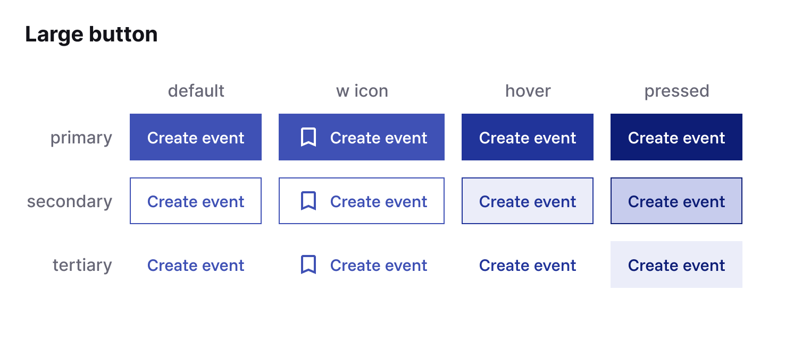
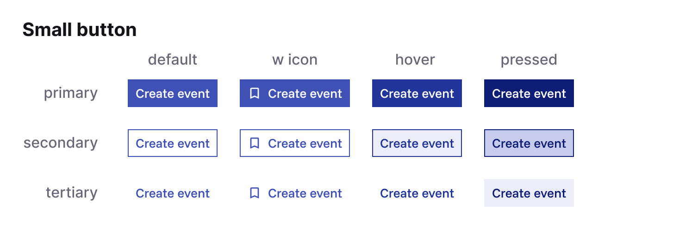

# Button Component

This is a reusable **React Button** component that supports:

- Multiple variants (`primary`, `secondary`, `tertiary`)
- Two sizes (`small`, `large`)
- Optional Material Symbols icon
- Native HTML button props (like `onClick`, `disabled`, `type`)




## Basic usage

The component defaults to the variant `primary` and the size `large`. It will have no icon unless specified. It will also have no native HTML button props unless specified.

```jsx
import Button from "./Button";

export default function Example() {
  return (
    <>
      <Button>Primary</Button>
      <Button variant="secondary" size="small">
        Secondary
      </Button>
      <Button variant="primary" icon="bookmark">
        With Icon
      </Button>
      <Button variant="tertiary" disabled>
        Disabled
      </Button>
    </>
  );
}
```

This will render the following HTML:

```html
<button class="btn btn--primary btn--large">
  <span class="btn__label">Primary</span>
</button>

<button class="btn btn--secondary btn--small">
  <span class="btn__label">Secondary</span>
</button>

<button class="btn btn--primary btn--large btn--icon">
  <span class="material-symbols-outlined">bookmark</span>
  <span class="btn__label">With Icon</span>
</button>

<button class="btn btn--tertiary btn--large" disabled>
  <span class="btn__label">Disabled</span>
</button>
```

## Do's ✅

The button holds the potential for an `onclick` function, which can be declared like this:

```js
<Button onClick={() => setCount((count) => count + 1)}>Count is {count}</Button>
```

## Dont's ❌

The `children` prop is not designed to contain anything else than a simple text string (with or without variables like shows above). Avoid using `<span>` tags inside the button label.

```jsx
<Button>
  <Icon variant="plus"></Icon> {/*This will render, but look weird*/}
  Add events
</Button>
```
