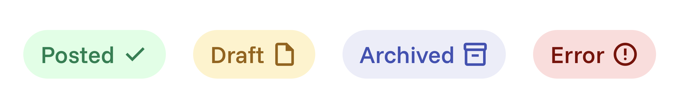

# TopicTag component

This component supports four fixed variants; `posted`, `draft`, `archived`, and `error`.
This component is hardcoded to display the right text label, icon, and color depending on the chosen variant.



## Basic usage

```jsx
import StatusTag from "./components/StatusTag/StatusTag.jsx";

export default function Example() {
  return (
    <>
      <StatusTag variant="posted" />
      <StatusTag variant="draft" />
      <StatusTag variant="archived" />
      <StatusTag variant="error" />
    </>
  );
}
```

This will redner the following HTML:

```html
<span class="status-tag status-tag--posted">
  <span class="status-tag__label">Posted</span>
  <span class="material-symbols-outlined">check_circle</span>
</span>

<span class="status-tag status-tag--draft">
  <span class="status-tag__label">Draft</span>
  <span class="material-symbols-outlined">draft</span>
</span>

<span class="status-tag status-tag--archived">
  <span class="status-tag__label">Archived</span>
  <span class="material-symbols-outlined">inventory_2</span>
</span>

<span class="status-tag status-tag--error">
  <span class="status-tag__label">Error</span>
  <span class="material-symbols-outlined">error</span>
</span>
```

## Do's ✅

- Use the variant prop exactly as specified and as a self closing tag (`<StatusTag .../>`).
- Use it purely as a visual indicator (e.g., to show status of an entity).
- Place it inline with other text or UI elements to indicate state clearly.

```jsx
<div>
  Article status: <StatusTag variant="posted" />
</div>
```

## Dont's ❌

- Don’t pass custom text or icons — these are fixed to ensure consistency.
- Don’t wrap interactive elements inside the tag.
- Don’t use the tag as a button substitute (it’s not meant to be clickable).

## TL;DR: All attributes in overview

```jsx
<StatusTag variant="posted || draft || archived || error" />
```
