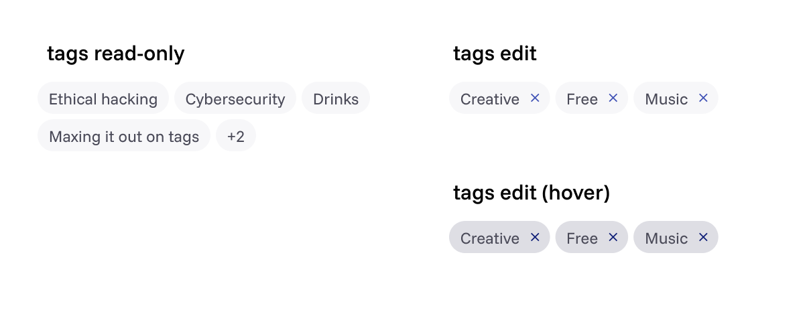

# TopicTag component

This component is designed to display tags or keywords throughout the platform. Main on our `Entry` component.

Supports two variants:

- `read` (**default**) → non-interactive tag
- `edit` → interactive tag with remove icon



## Basic usage

The component takes in a required `text` prop and an optional `variant` and `onClick` handler.

```jsx
import TopicTag from "./components/TopicTag/TopicTag.jsx";

export default function Example() {
  return (
    <>
      <TopicTag text="Cybersecurity" />
      <TopicTag
        text="Creative"
        variant="edit"
        onClick={() => console.log("Removed")}
      />
    </>
  );
}
```

This will render the following HTML:

```html
<!-- Read-only -->
<button class="topic-tag topic-tag--read" type="button" disabled>
  <span class="topic-tag__label">Cybersecurity</span>
</button>

<!-- Edit -->
<button class="topic-tag topic-tag--edit" type="button">
  <span class="topic-tag__label">Creative</span>
  <span class="material-symbols-outlined topic-tag__icon">close</span>
</button>
```

---

## All attributes in overview

```jsx
<TopicTag
  text="Topic name"
  variant="read || edit"
  onClick={() => console.log("Clicked!")}
/>
```

| Attribute | Type     | Required | Defaults to | Description                                                              |
| --------- | -------- | -------- | ----------- | ------------------------------------------------------------------------ |
| `text`    | string   | yes      | –           | The text label of the tag                                                |
| `variant` | string   | no       | `read`      | Controls whether the tag is editable or not                              |
| `onClick` | function | no       | –           | Callback for when the tag is clicked (only works with `variant="edit"`). |
